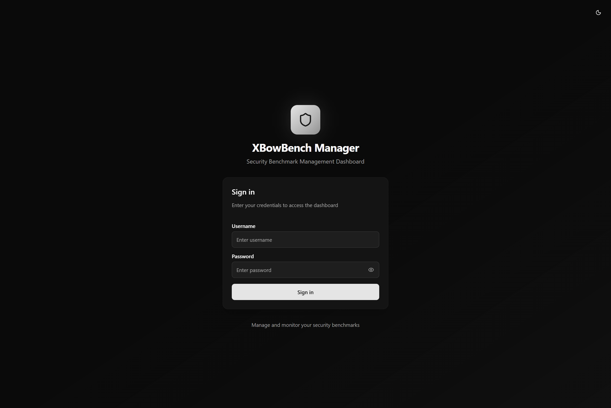
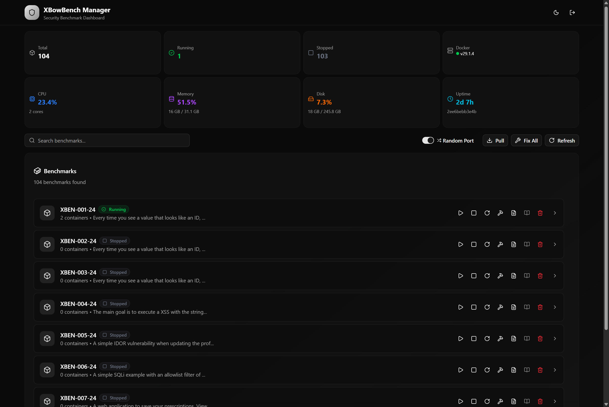
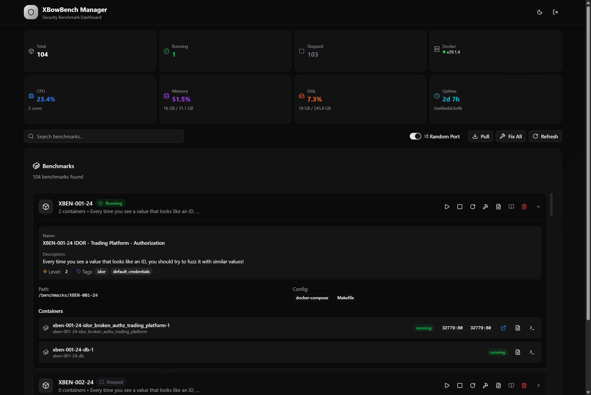

# XBowBench Manager

A modern web-based dashboard for managing XBowBench security benchmarks. Built with **Next.js 15** and **shadcn/ui**.

<p align="center">
  
</p>

<p align="center">
  
</p>

## ✨ Features

| Feature | Description |
|---------|-------------|
| 📊 **Dashboard Overview** | View all 100+ benchmarks with real-time status indicators |
| 🐳 **Docker Management** | Start, stop, restart, and build benchmark containers with one click |
| 📝 **Build Logs** | View Docker Compose build logs for each benchmark |
| 📜 **Container Logs** | View individual container logs in real-time |
| 🖥️ **Shell Access** | Execute commands directly inside running containers |
| 📖 **README Viewer** | View benchmark documentation with Markdown rendering |
| 🔗 **Quick Access Links** | One-click access to web-based benchmark UIs |
| 📈 **System Stats** | Real-time CPU, Memory, Disk usage monitoring |
| 🎨 **Dark/Light Mode** | Theme toggle support |
| 🔐 **Authentication** | Secure login with JWT tokens |
| 🔄 **Git Integration** | Pull latest benchmarks from repository |
| 🛠️ **Auto Fix** | Automatically fix benchmark configurations |

<p align="center">
  
</p>

## 🚀 Quick Start with Docker (Recommended)

### 1. Clone the repository

```bash
git clone https://github.com/your-repo/xbowbench.git
cd xbowbench
```

### 2. Create environment file

```bash
cp .env.example .env
```

Edit `.env` with your configuration:

```env
PORT=3000
ADMIN_USERNAME=admin
ADMIN_PASSWORD=your-secure-password
JWT_SECRET=your-super-secret-jwt-key-minimum-32-characters
APP_ACCESS=http://your-server-ip
```

### 3. Build and run

```bash
docker compose up -d --build
```

The application will be available at `http://localhost:3000`

### 4. View logs

```bash
docker compose logs -f
```

### 5. Stop

```bash
docker compose down
```

## 📦 Manual Installation

### 1. Install dependencies

```bash
npm install
```

### 2. Configure environment

```bash
cp .env.example .env.local
```

Edit `.env.local` with your settings.

### 3. Build for production

```bash
npm run build
```

### 4. Start the server

```bash
npm start
```

## 🔧 Development

```bash
npm run dev
```

Open [http://localhost:3000](http://localhost:3000) to view the app.

## ⚙️ Environment Variables

| Variable | Description | Default |
|----------|-------------|---------|
| `PORT` | Server port | `3000` |
| `ADMIN_USERNAME` | Login username | `admin` |
| `ADMIN_PASSWORD` | Login password | **Required** |
| `JWT_SECRET` | JWT signing key (min 32 chars) | **Required** |
| `BENCHMARKS_PATH` | Path to benchmarks directory | `../validation-benchmarks/benchmarks` |
| `DOCKER_SOCKET_PATH` | Docker socket path | `/var/run/docker.sock` |
| `APP_ACCESS` | Base URL for benchmark links | `http://localhost` |

## 🐳 Docker Image

The production Docker image uses multi-stage builds with Node.js Alpine base:

- **Image Size**: ~340MB
- **Content Size**: ~82MB

## 📁 Project Structure

```
xbowbench/
├── src/
│   ├── app/                 # Next.js App Router
│   │   ├── api/             # API routes
│   │   │   ├── auth/        # Authentication endpoints
│   │   │   ├── benchmarks/  # Benchmark management
│   │   │   ├── containers/  # Container logs & exec
│   │   │   ├── docker/      # Docker info & stats
│   │   │   └── fix/         # Benchmark fixer
│   │   ├── dashboard/       # Main dashboard page
│   │   └── login/           # Authentication page
│   ├── components/          # React components
│   │   └── ui/              # shadcn/ui components
│   └── lib/                 # Utility functions
│       ├── auth.ts          # Authentication logic
│       ├── docker.ts        # Docker integration
│       └── fixer.ts         # Benchmark fixer
├── docs/
│   └── images/              # Documentation images
├── Dockerfile               # Multi-stage Docker build
├── docker-compose.yml       # Docker Compose configuration
└── .env.example             # Environment template
```

## 🔌 API Endpoints

| Endpoint | Method | Description |
|----------|--------|-------------|
| `/api/auth/login` | POST | Authenticate user |
| `/api/auth/logout` | POST | Logout user |
| `/api/auth/session` | GET | Get current session |
| `/api/benchmarks` | GET | List all benchmarks |
| `/api/benchmarks` | POST | Pull latest benchmarks |
| `/api/benchmarks/[id]` | POST | Start/stop/restart/build benchmark |
| `/api/benchmarks/[id]/logs` | GET | Get benchmark build logs |
| `/api/containers/[id]/logs` | GET | Get container logs |
| `/api/containers/[id]/exec` | POST | Execute command in container |
| `/api/docker` | GET | Get Docker and system info |
| `/api/fix` | POST | Fix benchmark configurations |

## 🔒 Security Notes

- The application requires Docker socket access for container management
- Use strong passwords and JWT secrets in production
- Consider using a reverse proxy (nginx) with SSL for production deployments
- The Docker socket is mounted read-only where possible

## 📋 System Requirements

- Docker 20.10+
- Node.js 22+ (for non-Docker deployment)
- Access to Docker socket

## 📄 License

MIT
